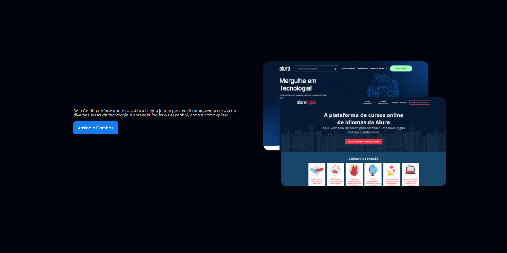
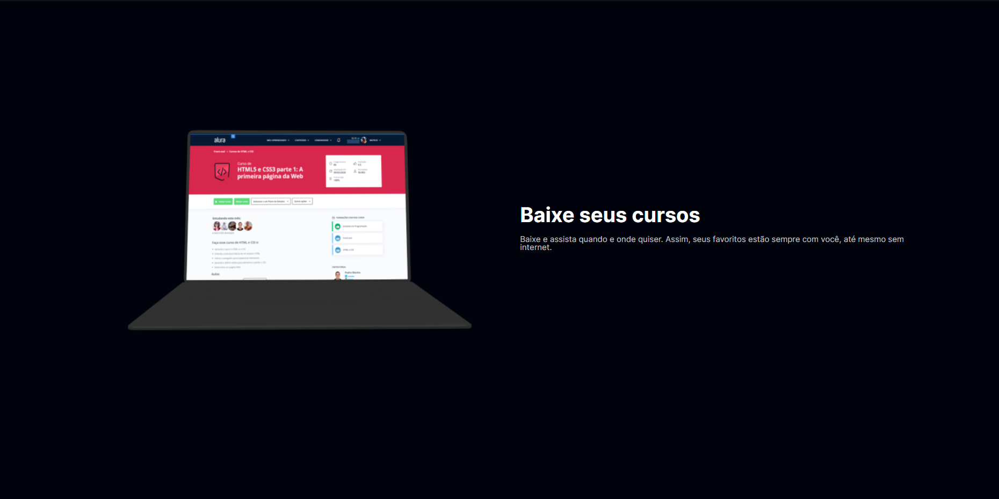

 # AluraPlus
AluraPlus is a website that was built using HTML and CSS. It was created as a project while I was taking classes at Alura School. The website is a simple landing page that provides information Alura+ combo and its benefits.
## Technologies Used
The following technologies were used to create AluraPlus:
* HTML: Hypertext Markup Language is the standard language for creating web pages. It is used to define the structure of a web page and to add content to it.
* CSS: Cascading Style Sheets are used to style web pages. They can be used to change the font, color, and layout of a web page.
## Features
AluraPlus has the following features:
* A responsive design that adapts to different screen sizes
* A clean and user-friendly interface
* Information about Alura+ and its benefits

## Conclusion
AluraPlus is a simple but effective website that provides information about Alura+. It is a great example of how HTML and CSS can be used to create a user-friendly and informative website.
